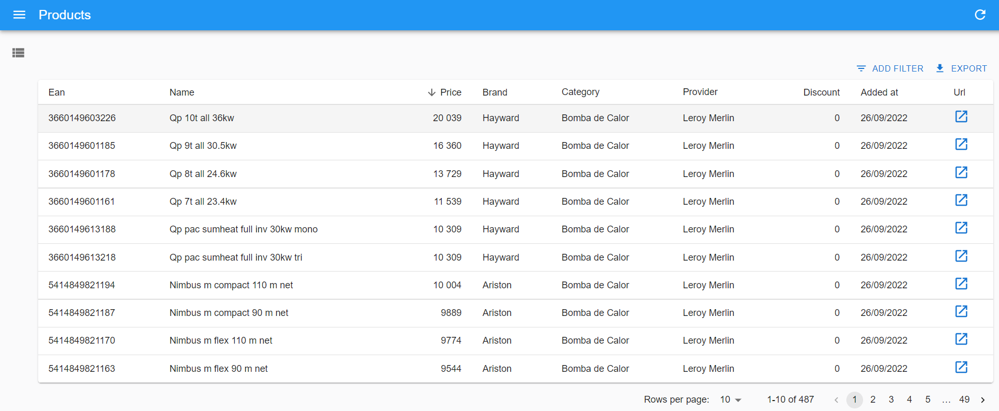
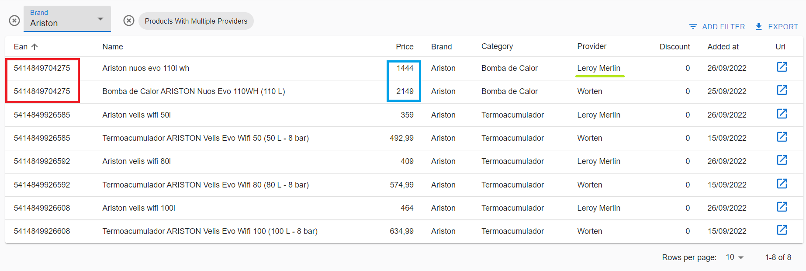
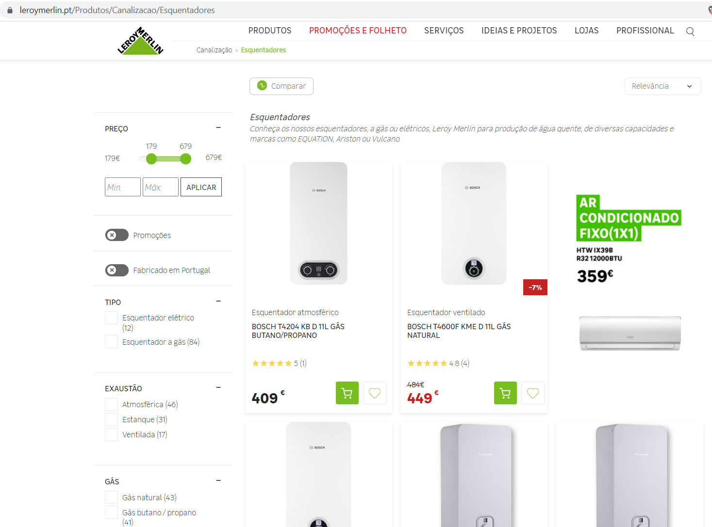

# Energy Products Scraping

This project aims to daily scrape energy products from different providers, and display them in a centralized way.

The project is currently live at: https://energy-products.netlify.app/ (Page not working properly anymore)

## Features

All of the products are displayed in a table, with the following **columns:**

- Ean: Unique identifier of the product, no matter which provider it comes from
- Name: Name on the provider's website (the same products with the same EAN, may appear with different names)
- Price: In Euros
- Brand
- Category: Esquentador, Termoacumulador, Bomba de Calor
- Provider: Worten, Leroy Merlin
- Discount: in %
- Added at: When it was scraped for the first time
- Url: Allows you to go directly to the web page of the product

We support **Sorting** (e.g. ordering the products by price or discount)

And **filtering**. Here are the supported **filters**:

- Ean
- Brand
- Category
- Provider
- Products with multiple providers: This tag will only show products that appear in more than 1 provider. With this, the user can better compare the prices of the same product for different providers.

In the example below, we filter by "Products with multiple providers" and "Brand=Ariston".

We can immediatly see the same products in the first 2 rows (same EAN), and observe how it is much cheaper for the provider "Leroy Merlin" in comparison to "Worten".

## Scraping

The scraping is done daily, with a cron job, and currently we are accessing 3 categories from 2 providers.

Providers:

- [Worten](https://www.worten.pt/)
- [Leroy Merlin](https://www.leroymerlin.pt/)

Categories:

- Esquentadores
- Termoacumuladores
- Bombas de Calore

Here is an example of the webpage of Leroy Merlin for the category "Esquentadores"

